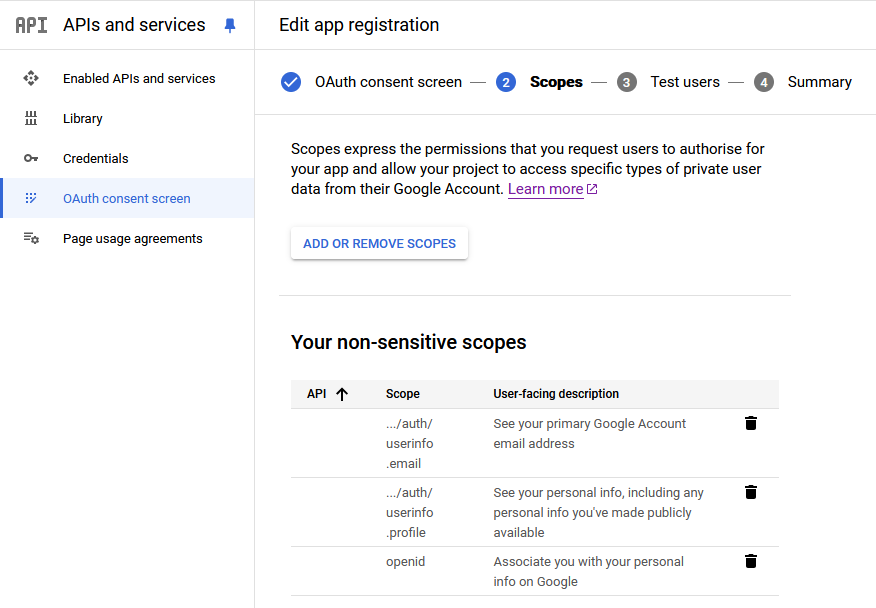
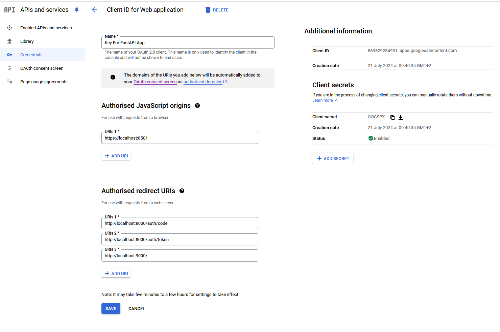
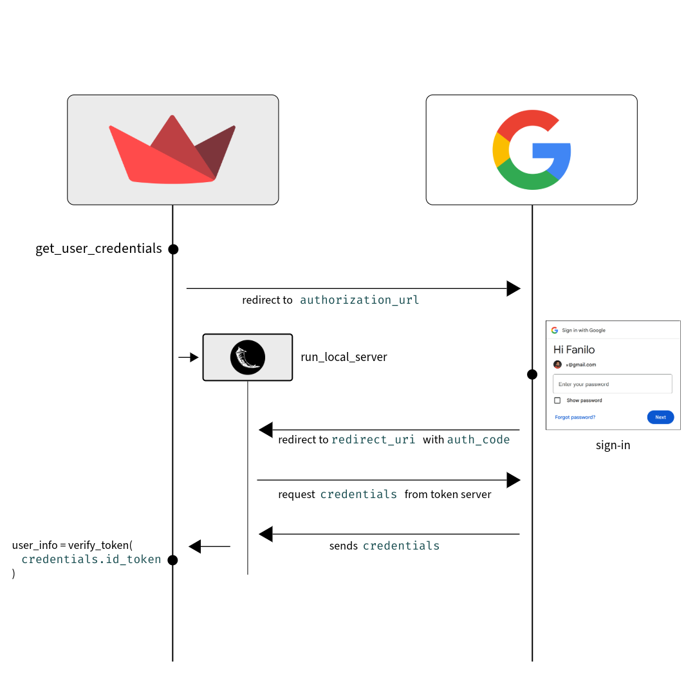
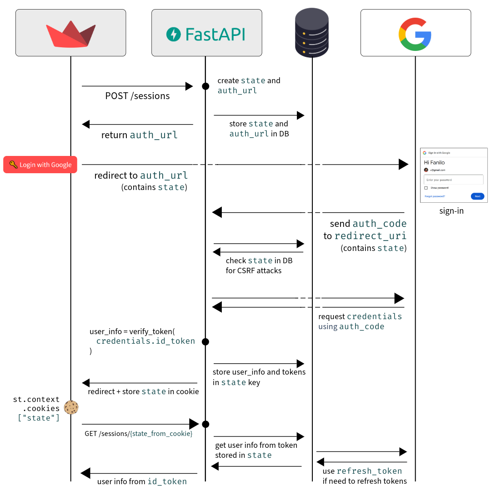

# Local exploration of Google Authentication in Streamlit

Playing with multiple ways of authenticating through a Google account within Streamlit:

- Decomposing server-side OAuth flow through [Google Auth Oauthlib](https://googleapis.dev/python/google-auth-oauthlib/latest/index.html) and [FastAPI](https://fastapi.tiangolo.com/) to catch redirect URIs and manage session cookies
- [Google Signin Button](https://developers.google.com/identity/gsi/web/guides/display-button#javascript) in a Streamlit Component
- [Firebase Authentication](https://firebase.google.com/docs/auth) with [Firebase UI](https://firebase.google.com/docs/auth/web/firebaseui) in a Streamlit Component

## Prerequisites

### Initialization

- A Google Project. Initialize one from the [GCP Console](https://console.cloud.google.com/)
- A Firebase Project. To keep things tidy, create a Firebase project over the previously created GCP Project through the [Firebase Console](https://console.firebase.google.com/)

### Streamlit configuration

- For practice's sake, [enable local HTTPS](https://docs.streamlit.io/develop/concepts/configuration/https-support) for your Streamlit app
  - I ran `openssl req -x509 -newkey rsa:4096 -nodes -out cert.pem -keyout key.pem -days 365` in WSL2 on Windows.
  - Then moved `cert.pem` and `key.pem` to `.streamlit` folder at root of project
  - Finally added `sslCertFile = ".streamlit/cert.pem"` and `sslKeyFile = ".streamlit/key.pem"` to `.streamlit/config.toml`

```toml
[server]
sslCertFile = ".streamlit/cert.pem"
sslKeyFile = ".streamlit/key.pem"
```

_Better use [Caddy](https://caddyserver.com/) or [Nginx](https://nginx.org/en/) to SSL proxify Streamlit & FastAPI_

### OAuth configuration

Head to [GCP Console](https://console.cloud.google.com/)

- In **APIs and services > OAuth consent screen**:

  - configure email, links on first page.
  - in Scopes second page, add OpenID Connect scopes: `openid`, `../auth/userinfo.profile` and `.../auth/userinfo.email`.
    - If you enabled the `Calendar API` (either by typing it in search bar or from **APIs and services >Enabled APIs and Services**), add the `.../auth/calendar.events.readonly` to ask the user for Calendar authorization



  - add tests users in 3rd page

- In **APIs and services > Credentials**, create a OAuth 2.0 Web Client ID and download it as a JSON file `client_secret.json` to the root of the project.
  - As authorised Javascript origins, I added the local Streamlit URL: `https://localhost:8501`
  - As authorised redirect URIs, I added:
    - `http://localhost:9000/`: Flask endpoint from google-oauthlib's `InstalledAppFlow.run_local_server` and `get_user_credentials` methods
    - `http://localhost:8000/auth/code` and `http://localhost:8000/auth/token`: our own FastAPI callback endpoints



- Copy the credentials `client_id` and `client_secret` to `.streamlit/secrets.toml` file

```toml
client_id="XXX.apps.googleusercontent.com"
client_secret="XXXXXX-..."
```

---

Next, head to [Firebase Console](https://console.firebase.google.com)

- In **Firebase Authentication > Sign-in method**, enable Google Provider.
- In **Project Overview > Project Settings > Service Acctouns**, generate a new private key and download JSON file as `firebase_secret.json` to the root of the project.
- In **Project Overview**, click the `Add app` button, and add a `Web` App. After creation, copy the `firebaseConfig` variable into a `firebase_client.json` file at the root of the project.

## Install

Install Python packages: `pip install -r requirements.txt`

## Run

Run Streamlit multipage app: `streamlit run streamlit_app.py`

- Access Streamlit app in `https://localhost:8501`

For pages 3 and 4, run FastAPI redirect server in parallel: `fastapi dev fastapi_server.py`.

- Access FastAPI OpenAPI in `http://localhost:8000/docs`. Visualize state of app in `/sessions` URI.

### Page 1 & 2: google-oauthlib run_local_server



* Good enough for local / on-premise deployments
* Wouldn't work on Streamlit Cloud because the Flask port is not open. Create your own Docker image to expose Streamlit + Flask ports

### Page 3 & 4: Catch redirect with custom FastAPI endpoint



* Deploy FastAPI separately as authentication and session cookie management service
* Hide both services behind reverse proxy with single URL
* I think it's a difficult setup to maintain. FastAPI + DB session cookies to replace with Firebase Authentication or Auth0 if you don't have time for this like me...
  * When Native OAuth+OIDC, redirects and custom endpoints appear in Streamlit, this solution seems the best

### Page 5 & 6: Frontend signin

* Streamlit Component which embeds Google / Firebase signin
* Google signin stores SIDCC cookie, Firebase uses API Keys+JWT in IndexedDB on browser to track user session
* Because of Streamlit Component iframe embed, doesn't work in deployments because CSRF issues. Streamlit host and iframe embedding signin have different addresses. 
  * Google Tap has [intermediate Iframe](https://developers.google.com/identity/gsi/web/amp/intermediate-iframe) that may solve this?